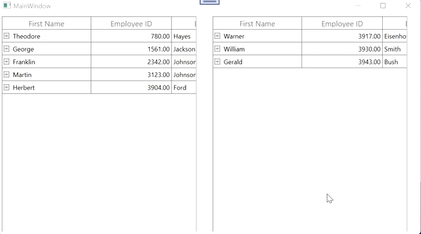

# How-to-perform-drag-and-drop-between-SfTreeGrids-by-copying-the-dragged-nodes-instead-of-moving-them
How to perform drag and drop between SfTreeGrids by copying the dragged nodes instead of moving them

By default, whenever you are performing the drag-and-drop between [WPF TreeGrid](https://www.syncfusion.com/wpf-controls/treegrid) (SfTreeGrid’s) the dragged nodes moved from one dragged TreeGrid to Dropped TreeGrid. You can customize this by copying the [DraggingNodes](https://help.syncfusion.com/cr/wpf/Syncfusion.UI.Xaml.TreeGrid.TreeGridRowDragStartEventArgs.html#Syncfusion_UI_Xaml_TreeGrid_TreeGridRowDragStartEventArgs_DraggingNodes) instead of moving it by overriding the [ProcessDragSourceOnDrop](https://help.syncfusion.com/cr/wpf/Syncfusion.UI.Xaml.TreeGrid.TreeGridRowDragDropController.html#Syncfusion_UI_Xaml_TreeGrid_TreeGridRowDragDropController_ProcessDragSourceOnDrop_Syncfusion_UI_Xaml_TreeGrid_SfTreeGrid_System_Collections_ObjectModel_ObservableCollection_Syncfusion_UI_Xaml_TreeGrid_TreeNode__) method using the custom [TreeGridRowDragDropController](https://help.syncfusion.com/cr/wpf/Syncfusion.UI.Xaml.TreeGrid.TreeGridRowDragDropController.html).


```c#
sfTreeGrid2.RowDragDropController = new TreeGridRowDragDropControllerExt();

public class TreeGridRowDragDropControllerExt : TreeGridRowDragDropController
{
    public TreeGridRowDragDropControllerExt()
    {

    }

    protected override void ProcessDragSourceOnDrop(SfTreeGrid sourceTreeGrid, Ob-servableCollection<TreeNode> nodes)
    {
        // By default, SfTreeGrid provide the support to move the item into one treegrid to another treegrid 
        //here we have customize the code snippets related to the Node
        //collection Moving function to copy function of One treegrid to another treegrid
        if (sourceTreeGrid == null || nodes == null)
        {
            return;
        }
    }
}
```

.

Take a moment to peruse the WPF [SfTreeGrid – drag and drop](https://help.syncfusion.com/wpf/treegrid/interactive-features#drag-and-drop-row) documentation, to learn more about filtering with code examples.

[View sample in GitHub](https://github.com/SyncfusionExamples/How-to-perform-drag-and-drop-between-SfTreeGrids-by-copying-the-dragged-nodes-instead-of-moving-them).
